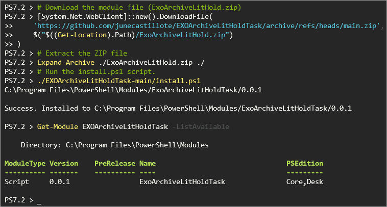

# EXOArchiveLitHoldTask

This module enables O365 admins to keep the online archive mailbox and litigation hold enabled for eligible users in Exchange Online.

## Which Mailboxes are Eligible?

The basis of eligibility is the [Mailbox Plan](https://docs.microsoft.com/en-us/exchange/recipients-in-exchange-online/manage-user-mailboxes/mailbox-plans) assigned to the mailbox, specifically the *`ExchangeOnlineEnterprise`* mailbox plan.

According to Microsoft, users with the following licenses have the *`ExchangeOnlineEnterprise`* mailbox plan assigned to their mailboxes.

- Microsoft 365 or Office 365 Enterprise E3
- Microsoft 365 or Office 365 Enterprise E5
- Exchange Online Plan 2

In short, only the user mailboxes with *`ExchangeOnlineEnterprise`* mailbox plan will be targeted by this module.

## Download and Install the Module

Download the code from the main branch → ‣

Or you can run this command to download and install the module in PowerShell.

> 💡 *Note: If you run PowerShell as admin on Windows or as root (sudo) in Linux, the module will be installed for all users. Otherwise, the module will be installed on the current user only.*
>
> *Reference:*
>
> *[about_PSModulePath (Windows PowerShell 5.1)](https://docs.microsoft.com/en-us/powershell/module/microsoft.powershell.core/about/about_psmodulepath?view=powershell-5.1)*
>
> *[about_PSModulePath (PowerShell 7.2)](https://docs.microsoft.com/en-us/powershell/module/microsoft.powershell.core/about/about_psmodulepath?view=powershell-7.2)*

```powershell
# Download the module file (ExoArchiveLitHold.zip)
[System.Net.WebClient]::new().DownloadFile(
    'https://github.com/junecastillote/EXOArchiveLitHoldTask/archive/refs/heads/main.zip',
    $("$((Get-Location).Path)/ExoArchiveLitHold.zip")
)

# Extract the ZIP file
Expand-Archive ./ExoArchiveLitHold.zip ./

# Run the install.ps1 script.
./EXOArchiveLitHoldTask-main/install.ps1

Get-Module EXOArchiveLitHoldTask -ListAvailable
```



## Functions and Parameters

This module comes with two main functions.

| Function                 | Purpose                                                                |
| ------------------------ | ---------------------------------------------------------------------- |
| Enable-ExoArchiveMailbox | Enable the Exchange Online Archive Mailbox for eligible users.         |
| Enable-ExoLitigationHold | Enable the Exchange Online Mailbox Litigation Hold for eligible users. |

Both the `Enable-ExoArchiveMailbox` and `Enable-ExoLitigationHold` have the same set of parameters, and none are required.

- `TestMode` - This is a *`Boolean`* parameter. If the value is *`$True`* (default), the command will only report the eligible mailboxes without making any changes. This mode is useful to test the task first and create a report of eligible users without an archive mailbox or with a disabled litigation hold.
- `ExclusionList` - This optional parameter accepts an *`array`* of email addresses of the mailboxes to be excluded from the task. Do not use this parameter if you don’t want to exclude any mailbox.
- `ReportDirectory` - Specify the output directory where the task will save the reports. If you do not specify this parameter, the default location will be: `$HOME\ExoArchiveLitHoldTask\<tenant_domain>`.
- `ReportType` - Specify `CSV` or `HTML`. The default type is `CSV` if you do not specify this parameter.
- `SendEmailByGraph` - Use this parameter if you’ll send the email report via Microsoft Graph. This email sending method is useful for organizations that disabled basic authentication for SMTP. This parameter accepts a hashtable, as shown below.


   > 💡 *Note: This email method requires that you have already registered an application in Azure AD with `Mail.Send` application permission in Microsoft Graph.*


    ```powershell
    @{
        ClientId            = '<application id>' # Mandatory
        TenantId            = '<your_domain.onmicrosoft.com>' # Mandatory
        CertificateOrSecret = <Client Secret> -OR- (Get-Item cert:\CurrentUser\my\<certificate thumbprint>) # Mandatory
        From                = 'Sender@your_domain.com' # Mandatory
        To                  = 'Recipient1@your_domain.com','Recipient2@your_domain.com' # Mandatory
        CC                  = '<OPTIONAL CC Recipients>' # Optional
        Bcc                 = '<OPTIONAL BCC Recipients>' # Optional
    }
    ```

- `SendEmailBySmtp` - Use this parameter if you’ll send the email report via SMTP relay. This parameter accepts a hashtable, as shown below.

    ```powershell
    @{
        SmtpServer          = '<you_smtp_server_address>' # Mandatory
        Port                = '<Port>' # Optional, if port is not 25
        UseSSL              = '$true or $false' # Optional, whether SMTP server requires TLS connection
        Credential          = '<PSCredential>' # Optional, use only if the SMTP server requires authentication
        From                = 'Sender@your_domain.com' # Mandatory
        To                  = 'Recipient1@your_domain.com', 'Recipient2@your_domain.com' # Mandatory
        CC                  = '<OPTIONAL CC Recipients>' # Optional
        Bcc                 = '<OPTIONAL BCC Recipients>' # Optional
    }
    ```


## Usage Examples

### Example 1: Run in Test Mode with Email Report via Office 365 Authenticated SMTP Relay

```powershell
<#
What will this example do?

* Run in test mode (no changes).
* Report type is CSV (email will be sent with the CSV file attached).
* Run the Enable Exchange Online Archive Mailbox Task and send an email report via Office 365 SMTP AUTH.
* Run the Enable Exchange Online Mailbox Litigation Hold Task and send an email via Office 365 SMTP AUTH.
#>

# Connect to Exchange Online PowerShell
Connect-ExchangeOnline

# Import the module
Import-Module EXOArchiveLitHoldTask -Force

<#
IMPORTANT:
This example exposes the SMTP password in plain text and must not be used
in production deployment.
You must use credential management to hide or encrypt the credentials.
#>

# Create the SMTP relay credential
$smtpCredential = [pscredential]::new('username@domain.com', (ConvertTo-SecureString 'password here' -AsPlainText -Force))

# Define the SMTP Email Report parameters for the SendEmailBySmtp parameter.
$sendEmailBySmtp = @{
    SmtpServer = 'smtp.office365.com'
    Port       = 587
    UseSSL     = $true
    Credential = $smtpCredential
    From       = 'sender@your_domain.com'
    To         = 'recipient1@yourdomain.com','recipient2@your_domain.com'
    # CC         = '<OPTIONAL CC Recipients>'
    # Bcc        = '<OPTIONAL BCC Recipients>'
}

# Run the Enable Exchange Online Archive Mailbox Task
$ExoArchiveMailboxTaskResult = Enable-ExoArchiveMailbox -SendEmailBySmtp $sendEmailBySmtp

# Run the Enable Exchange Online Mailbox Litigation Hold Task
$ExoLitigationHoldTaskResult = Enable-ExoLitigationHold -SendEmailBySmtp $sendEmailBySmtp
```


### Example 2: Run in Test Mode with Email Report via Microsoft Graph with Secret Key

```powershell
<#
What will this example do?

* Run in test mode (no changes).
* Report type is HTML (email will be sent with the list of mailboxes in the email body).
* Run the Enable Exchange Online Archive Mailbox Task and send an email report via Microsoft Graph.
* Run the Enable Exchange Online Mailbox Litigation Hold Task and send an email via Microsoft Graph.
#>

# Connect to Exchange Online PowerShell
Connect-ExchangeOnline

# Import the module
Import-Module EXOArchiveLitHoldTask -Force

# Define the Microsoft Graph API parameters for the SendEmailByGraph parameter.
# NOTE: Avoid using Secrets whenever possible. Use certificates instead.
$SendEmailByGraph = @{
    ClientId            = 'Application ID'
    TenantId            = 'Tenant Domain or Tenant ID'
    CertificateOrSecret = 'Application Secret Key'
    From                = 'sender@your_domain.com'
    To                  = 'recipient1@yourdomain.com','recipient2@your_domain.com'
    # CC         = '<OPTIONAL CC Recipients>'
    # Bcc        = '<OPTIONAL BCC Recipients>'
}

# Run the Enable Exchange Online Archive Mailbox Task
$ExoArchiveMailboxTaskResult = Enable-ExoArchiveMailbox -ReportType HTML -SendEmailByGraph $SendEmailByGraph

# Run the Enable Exchange Online Mailbox Litigation Hold Task
$ExoLitigationHoldTaskResult = Enable-ExoLitigationHold -ReportType HTML -SendEmailByGraph $SendEmailByGraph

```

### Example 3: Non-Interactive with App-Only Authentication in Exchange and Send Email via Microsoft Graph

This example is useful for automation scenarios because you don’t need to interactively authenticate with Exchange Online PowerShell (certificate-based log in). Also, you don’t need to worry about credential management.

```powershell
<#
What will this example do?

* Connect to Exchange Online PowerShell using certificate-based (app-only) authentication.
* Report type is HTML (email will be sent with the list of mailboxes in the email body).
* Run the Enable Exchange Online Archive Mailbox Task and send an email report via Microsoft Graph.
* Run the Enable Exchange Online Mailbox Litigation Hold Task and send an email via Microsoft Graph.
#>

# Connect to Exchange PowerShell
Connect-ExchangeOnline `
-AppId "Application ID" `
-Certificate $(Get-Item Cert:\CurrentUser\My\<CERTIFICATE THUMBPRINT>) `
-Organization 'your_tenant.onmicrosoft.com'

# Define the Microsoft Graph API parameters for the SendEmailByGraph parameter.
$SendEmailByGraph = @{
    ClientId            = 'Application ID'
    TenantId            = 'Tenant Domain or Tenant ID'
    CertificateOrSecret = $(Get-Item Cert:\CurrentUser\My\<CERTIFICATE THUMBPRINT>)
    From                = 'sender@your_domain.com'
    To                  = 'recipient1@yourdomain.com','recipient2@your_domain.com'
}

# Run the Enable Exchange Online Archive Mailbox Task
$ExoArchiveMailboxTaskResult = Enable-ExoArchiveMailbox -ReportType HTML -SendEmailByGraph $SendEmailByGraph

# Run the Enable Exchange Online Mailbox Litigation Hold Task
$ExoLitigationHoldTaskResult = Enable-ExoLitigationHold -ReportType HTML -SendEmailByGraph $SendEmailByGraph

```

## ANNEX 1: Sample Report

### HTML Email


### CSV File


## ANNEX 2: Register App for App-Only Authentication in Exchange and Sending Email via Microsoft Graph

If you’re planning to use this module in automation or unattended jobs, it is highly recommended to register an app in Azure AD and use certificate-based authentication.

The application must have the following API permissions.

| API                        | Permission           | Purpose                                                      |
| -------------------------- | -------------------- | ------------------------------------------------------------ |
| Microsoft Graph            | Mail.Send            | Send email using any valid email address in Exchange Online. |
| Office 365 Exchange Online | Exchange.ManageAsApp | Manage Exchange as an Application.                           |

### Create a Self-Signed Certificate

Open PowerShell on your computer.

Run the below code to generate a new self-signed certificate.

```powershell
# Generate a self-signed certificate
$certSplat = @{
    Subject           = 'ExoArchiveLitHoldTask'
    NotBefore         = ((Get-Date).AddDays(-1))
    NotAfter          = ((Get-Date).AddYears(3))
    CertStoreLocation = "Cert:\CurrentUser\My"
    Provider          = "Microsoft Enhanced RSA and AES Cryptographic Provider"
    HashAlgorithm     = "SHA256"
    KeySpec           = "KeyExchange"
}
$selfSignedCertificate = New-SelfSignedCertificate @certSplat

# Display the certificate details
$selfSignedCertificate | Format-List PSParentPath, ThumbPrint, Subject, NotAfter

# Export the certificate to PFX.
$selfSignedCertificate | Export-PfxCertificate -FilePath .\ExoArchiveLitHoldTask.pfx -Password $(ConvertTo-SecureString -String "Transpire^Struck8^Impurity^Draw" -AsPlainText -Force)

# Export the certificate to CER.
$selfSignedCertificate | Export-Certificate -FilePath .\ExoArchiveLitHoldTask.cer
```

### Register the App

> 💡 *NOTE: This requires that you have the [Microsoft Graph PowerShell](https://docs.microsoft.com/en-us/powershell/microsoftgraph/overview) module installed on your computer.*

1. Connect to Microsoft Graph PowerShell.

    ```powershell
    Connect-MgGraph -Scopes 'Application.ReadWrite.All RoleManagement.ReadWrite.Directory'
    ```

    

2. Define the API permissions needed by your app. Copy the code below and run it in PowerShell. DO NOT CHANGE ANYTHING IN THE CODE!

    ```powershell
    $RequiredResourceAccess = @(
        [ordered]@{
            ResourceAppId  = "00000002-0000-0ff1-ce00-000000000000"; # Microsoft Graph
            ResourceAccess = @(
                @{
                    Id   = "dc50a0fb-09a3-484d-be87-e023b12c6440"; # Mail.Send
                    Type = "Role"
                }
            )

        },
        [ordered]@{
            ResourceAppId  = "00000003-0000-0000-c000-000000000000"; # Office 365 Exchange Online
            ResourceAccess = @(
                @{
                    Id   = "b633e1c5-b582-4048-a93e-9f11b44c7e96"; # Exchange.ManageAsApp
                    Type = "Role"
                }
            )
        }
    )
    ```

3. Compose the certificate credentials of your application. Copy the code and run it PowerShell. DO NOT CHANGE ANYTHING IN THE CODE!

    ```powershell
    $keyCredentials = @(
        [ordered]@{
            EndDateTime   = $($selfSignedCertificate.NotAfter.ToUniversalTime())
            StartDateTime = $($selfSignedCertificate.NotBefore.ToUniversalTime())
            keyId         = $((New-Guid).Guid)
            type          = 'AsymmetricX509Cert'
            usage         = 'Verify'
            displayName   = $($selfSignedCertificate.Subject)
            key           = $selfSignedCertificate.GetRawCertData()
        }
    )
    ```

4. Register the app and enable the service principal. DO NOT CHANGE ANYTHING IN THE CODE!

    ```powershell
    $app = New-MgApplication -DisplayName 'ExoArchiveLitHoldTask' -RequiredResourceAccess $RequiredResourceAccess -SignInAudience AzureADMyOrg -Web @{RedirectUris = 'http://localhost' } -KeyCredentials $keyCredentials
    $sp = New-MgServicePrincipal -AppId $app.AppId
    ```

5. Add the service principal to the ‘Exchange administrator’ role group. DO NOT CHANGE ANYTHING IN THE CODE!

    ```powershell
    $roleDefinitionId = (Get-MgRoleManagementDirectoryRoleDefinition -Filter "DisplayName eq 'Exchange Administrator'").Id
    New-MgRoleManagementDirectoryRoleAssignment -PrincipalId $sp.Id -RoleDefinitionId $roleDefinitionId -DirectoryScopeId "/"
    ```


### Grant Consent

1. Launch the consent URL in your default browser. Replace the `<your_tenant_domain>` with your O365 tenant domain. For example, `contoso.onmicrosoft.com`.

    ```powershell
    Start-Process "https://login.microsoftonline.com/<your_tenant_domain>/adminconsent?client_id=$($app.AppID)"
    ```

2. Accept the permission request.

    

3. Close the web browser. Don’t worry about the 404 error. That’s expected.

    